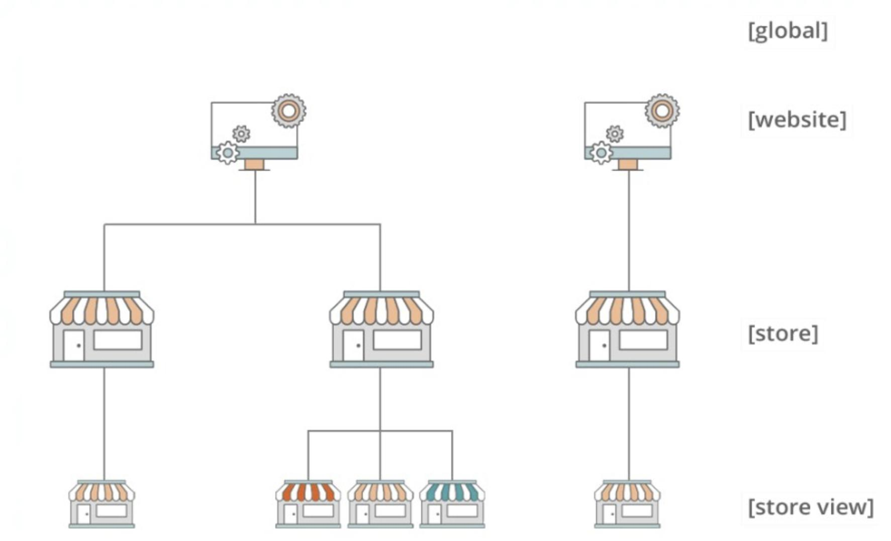

### 1. An Adobe Commerce developer creates a custom router class.

### Which interface should the class implement?

- ```\Magento\Framework\App\Http\RouterInterface```
- ```\Magento\Framework\App\RouterInterface```    👈
- ```\Magento\Framework\App\RouterListInterface```

_Choose 1 option._

### 2. An Adobe Commerce developer is tasked with adding the parent order's increment id to creditmemos fetched through

```Magento\Sales\Model\Order\CreditmemoRepository```. To implement this, they choose to create an extension attribute
and use the join directive as follows:

```xml

<config xmlns:xsi="http://www.w3.org/2001/XMLSchema-instance"
        xsi:noNamespaceSchemaLocation="urn:magento:framework:Api/etc/extension_attributes.xsd">
    <extension_attributes for="Magento\Sales\Api\Data\CreditmemoInterface">
        <attribute code="order_increment_id" type="string">
            <join reference_table="sales_order" reference_field="entity_id" join_on_field="order_id">
                <field>increment_id</field>
            </join>
        </attribute>
    </extension_attributes>
</config>
```

### After a few tests, the developer realizes that the development is not working as expected and that the creditmemos fetched do not contain the increment id. What is the reason for this?

- The join directive for extension attributes does not exist so it is simply ignored by Magento and nothing gets added.
- The fields used for the join are inverted reference_field should have contained `order_id` and `join_on_field` should
  have
  contained `entity_id`.
- **The join directive only works for `getList()` calls, in this case the creditmemos are fetched using `get()`.** 👈

_Choose 1 option._

### 3. An Adobe Commerce developer is being tasked with disabling a cron job added by a third-party module. The developer has already created a new module with a dependency on the third-party

module:

```xml

<group id="default">
    <job name="reminder_email" instance="Vendor\Module\Model\ReminderEmail" method="execute">
        <schedule>0 0 ** *</schedule>
    </job>
</group>
```

### What would a developer do to disable the cron job?

- Rewrite the `reminder_email` cron job to add `disable="true"` to the job node.

```xml
<?xml version="1.0"?>
<config xmlns:xsi="http://www.w3.org/2001/XMLSchema-instance"
        xsi:noNamespaceSchemaLocation="urn:magento:module:Magento_Cron: etc/crontab.xsd">
    <group id="default">
        <job name="reminder_email" instance="Vendor\Module\Model\ReminderEmail" method="execute" disable="true">
            <schedule>0 0 ** *</schedule>
        </job>
    </group>
</config>
```

- **Rewrite the `reminder_email` cron job schedule to run on a date that which will never occur.** 👇 👈

```xml
<?xml version="1.0"?>
<config xmlns:xsi="http://www.w3.org/2001/XMLSchema-instance"
        xsi:noNamespaceSchemaLocation="urn: magento: module:Magento_Cron: etc/crontab.xsd">
    <group id="default">
        <job name="reminder_email" instance="Vendor\Module\Model\ReminderEmail" method="execute">
            <schedule>0 0 30 2 *</schedule>
        </job>
    </group>
</config>
```

- Create a `crontab.xml` file and use a `referenceJob` node to add `disable="true"` to the `reminder_email` cron job.

```xml 
<?xml version="1.0"?>
<config xmlns:xsi="http://www.w3.org/2001/XMLSchema-instance"
        xsi:noNamespaceSchemaLocation="urn: magento:module:Magento_Cron: etc/crontab.xsd">
    <group id="default">
        <referenceJob name="reminder email" disable="true"/>
    </group>
</config>
```

_Choose 1 option._

### 4. An Adobe Commerce developer is tasked with disabling an existing observer for the wishlist_product_add_after event.

### What would be the recommended way to achieve this?

- **Create a new `events.xml` file, declare the same event and observer name, then add `disabled="true"`.** 👈
- Create an around plugin on the execute method of the observer instance and stop the execution.
- Create a preference on the observer instance and override the complete function to stop the execution.

_Choose 1 option._

### 5. An Adobe commerce merchant has a store with multiple product types. Specific content needs to be added only to the simple products.

### Which layout should a developer use to achieve this?

- **catalog_product_view_type_simple.xml** 👈
- catalog_product_type_simple.xml
- catalog_product_view.xml
- catalog_category_view_product_simple.xml

_Choose 1 option._

### 6. An Adobe Commerce developer is tasked by a client to create a system configuration to store information about their company's multiple social media profiles (Facebook, Twitter, Instagram, etc.). They want to be able to control both the name of the service, as well as the URL, to their profile/page on said service, as well as adding more themselves in the future.
### How would the developer create an optimum system configuration to accomplish this task?

- Create a text_json system config so they can enter `JSON` data directly.
- Create a separate text type system configuration for each social media platform.
- **Create a Dynamic Row system config using the `ArraySerialized` `backend_model` and a custom `frontend_model`.** 👈

_Choose 1 option._

### 7. A user issuing a request similar to GET

`<host>/rest/<store_code>/V1/products/<sku>` receives product information similar to the following:

```json
{
  "sku": "tshirt1",
  "price": "20.00",
  "description": "New JSmith design",
  "extension_attributes": {
    "logo size": "small"
  },
  "custom_attributes": {
    "artist": "James Smith"
  }
}
```

### They were expecting to include the stock status and quantity as part of the result.

### Why would this be missing from the response?

- The stock status is only returned for products that have `is_saleable` attribute as true.
- This needs to be done as a `POST` instead of `GET`.
- **This is an anonymous or unauthenticated user and they are not allowed to view this information. 👈**

_Choose 1 option._

### 8. A developer has built a custom module that introduces a new entity. A client reports that after saving the new entity value in the backend, the frontend page still contains an old value.

### How should the developer make sure that the frontend page shows the updated value?

- Layout files must have cacheable=false set on specific block `sections.xml` file must have defined routes where the
  cache should be cleared
- An implementation of `IdentityInterface` for the frontend block
- cache.xml file must have a definition to clear the cache automatically

_Choose 1 option._

### 9. Refer to the image of the website hierarchy.



### How many different themes can be configured in the shop based on this hierarchy?

- Three, because themes are applied per store level
- **Five, because themes are applied per store view level** 👈
- One, because only one theme is allowed in a single instance
- Two, because themes are applied only per website level

_Choose 1 option._

### 10. An Adobe Commerce developer is working on a site with a multi-store setup containing a main retail store, and a secondary B2B store. They would like the sales emails from the B2B store to use product image URLs from the retail store. To achieve this they have used a plugin on the URL generation method to call

`Emulation::startEnvironmentEmulation`, passing through the correct `$storeId` and `$area`.

### However, they find that the URLs B2B sales emails are unchanged, and no exceptions are being thrown. Given that email generation already uses area emulation, why is this?

- Only one level of emulation is permitted at any one time.
- Emulation does not effect URLs which are stored fully qualified against the product.
- The $force parameter required to override this needs to be provided.

_Choose 1 option._

### 11. An Adobe Commerce developer is writing an integration test and needs to initialize the \MyVendor\MyModule\Model\MyClass class in order to test its logic. The class has one constructor parameter:

`\Magento\Customer\Api\CustomerRepositoryInterface $customerRepository`

### The test class and the test method inside have been written and the test framework's object manager has been instantiated into the

`$objectManager` variable.

### How is the `MyClass` class initialized?

-  ```php 
    $repository = $objectManager->instantiatePreference(\Magento\Customer\Api\CustomerRepositoryInterface::class);
    $myClass = new \MyVendor\MyModule\Model\MyClass($repository); 
    ``` 
- ```php
  $repository =$this->getMockClass(\Magento\Customer\Api\CustomerRepositoryInterface::class);
  $myClass = $objectManager->create(\MyVendor\MyModule\Model\MyClass::class, ['customerRepository' => $repository]);
  ```
- ```php
  $myClass = $objectManager->create(\MyVendor\MyModule\Model\MyClass::class);
  ```
  ☝️

_Choose 1 option._

### 12. An Adobe Commerce developer is working on a notification module. `MyVendor\Notification\Block\GuestNotifications` and `MyVendor\Notification\Block\CustomerNotifications` blocks have parameter `$notification` of type `MyVendor\Notification\Api\NotificationRepositoryInterface.`
### The service contract `MyVendor\Notification\Api\NotificationRepositoryInterface` and its concrete implementation `MyVendor\Notification\Model\NotificationRepository` are created.
### How would the `MyVendor\Notification\Model\NotificationRepository` implement `MyVendor\Notification\Api\NotificationRepositoryInterface`?

- **Declare interface preference. The object manager uses this mapping to handle interface type parameter injection.** 👈
  ```xml
  <preference
      for="MyVendor\Notification\Api\NotificationRepositoryInterface" 
      type="MyVendor\Notification\Model\NotificationRepository"
  />
  ```
- Declare parameter preference for both `GuestNotifications` and `CustomerNotifications`.
  ```xml
  <type name="GuestNotifications">
    <arguments>
        <argument name="notification" xsi:type="interface">MyVendor\Notification\Model\NotificationRepository</argument>
    </arguments>
  </type>
  ...
  <type name="CustomerNotifications">
      <arguments>
          <argument name="notification" xsi:type="interface">MyVendor\Notification\Model\NotificationRepository</argument>
      </arguments>
  </type>
  ```
    
- Declare NotificationRepository as a virtual type for NotificationRepositoryInterface.
  ```xml
  <virtualType
    name="MyVendor\Notification\Model\NotificationRepository"
    type="MyVendor\Notification\Api\NotificationRepositoryInterface"
  />
  ```

_Choose 1 option._


### 13. An Adobe Commerce developer starts a project where inventory is going to be managed outside of Magento using a custom connector module. A decision has been made to completely remove all Magento modules related to inventory as the first step to improve application performance. Over 70 such modules were identified, starting with `magento/module-inventory` (`Magento_Inventory`) and ending with `magento/module-inventory-wishlist` (`Magento_InventoryWishlist`). The developer already ran the following command:
### `composer create-project --repository-url=https://repo.magento.com/ magento/project-community-edition myproject`
### How can the developer ensure that modules related to inventory modules are removed from the codebase before Magento gets installed?

- Run the following command and include all the necessary modules: `bin/magento module: uninstall Magento_Inventory, ... ,Magento_InventoryWishlist`
- Include the following node in the main `composer.json` file of the project including all the necessary modules and run `composer update`: 
  ```json
    "replace": {
      "magento/module-inventory": "*",
      ...
      "magento/module-inventory-wishlist": "*"
    }
  ```
  ☝️
- Update the `autoload` > `exclude-from-classmap` node with namespaces of the modules to remove in the main composer.json file and run `composer update`:
  ```json
  "autoload": {
    ...
    "exclude-from-classmap": [
      "Magento\\Inventory\\**,
      ...
      "Magento\\InventoryWishlist\\**,
      ...
    ],
    ...
  }
  ```

_Choose 1 option._

_Preference: https://experienceleague.adobe.com/en/docs/commerce-admin/inventory/get-started/install-update#remove-inventory-management_


### 14. There is a task to fix the output script injection for the following line of a `.phtml` file. 
### `<div data-bind='settings: <?= $myJson ?>'></div>`
### As an Adobe Commerce developer, what should be the correct escape method to use for JSON code inside an HTML attribute?

- `<div data-bind='settings: <?= $escaper->escapeJs($myJson) ?>'></div>`
- `<div data-bind='settings: <?= $escaper->escapeJson($myJson) ?>'></div>`
- `<div data-bind='settings: <?= $escaper->escapeHtmlAttr($myJson) ?>'></div>` 👈

_Choose 1 option._


### 15. An Adobe Commerce developer is adding a new system configuration field to the admin area. The new field will be used to store sensitive data that will be encrypted in the database. How would the developer add a configuration field with these constraints?


- ```xml
  <field id="secret_data" type="password" translate="label" sortOrder="10" showInDefault="1" showInWebsite="1" showInStore="1">
      <label>Secret Data</label>
  </field>
  ```

- ```xml
  <field id="secret_data" type="obscure" translate="label" sortOrder="10" showInDefault="1" showInWebsite="1" showInStore="1">
    <label>Secret Data</label>
    <backend_model>Magento\Config\Model\Config\Backend\Encrypted</backend_model>
  </field>
  ```
  ☝️

- ```xml
  <field id="secret_data" type="encrypted" translate="label" sortOrder="10" showInDefault="1" showInWebsite="1" showInStore="1">
    <label>Secret Data</label>
    <backend_model>Magento\Config\Model\Config\Backend\Encrypted</backend_model>
  </field>
  ```

_Choose 1 option._


### 16. An Adobe Commerce developer has attached observer to the `sales_order_save_before` event. In the execute method of the observer the developer modifies order info and invokes `\Magento\Sales\Model\Order::save` method.
### What is the end result?

- Adobe Commerce will throw an exception.
- **It will cause a cyclical event loop.** 👈
- The order will be saved successfully.

_Choose 1 option._


### 17. An Adobe Commerce developer is assisting a junior developer on their team. The junior developer is trying to add an additional attribute to select for a product collection of a block that extends `\Magento\Catalog\Block\Product\ListProduct`. The developer has attempted to do this by creating a plugin to the block:
```php
public function afterToHtml(\Vendor\CustomCatalog\Block\Product\ListProduct $subject, $result) {
    $subject->addAttribute('custom_attribute');
    return $resu<
}
```
### Why does this not work correctly?

- The plugin cannot return the `$result` argument because the developer is trying to modify the output. The developer should return `$subject->toHtml()` instead to ensure the updated markup is rendered.
- **The load method of the collection has already been called in the **block's_beforeToHtml** method, so the modification of the select statement was made too late.** 👈
- The `ListProduct` block does not contain an `addAttribute` method. Instead, the developer should have called `$subject->getProductCollection()->addAttributeToSelect('custom_attribute')`.

_Choose 1 option._


### 18. An Adobe Commerce developer has been asked to create a custom Page Builder content type to render a grid of tiles showing available categories that can be clicked to navigate to the resulting product listing page. This content type accepts parameters to determine which categories to display. The client has asked that the User be able to see the resulting tiles appear in the Stage after the settings on the content type have been saved.
### How can this be accomplished?

- Override the `afterObservablesUpdated` method of the `preview.js` file and call the `getPreview('content-type-name')` method from `Magento_PageBuilder/js/config`, where `content-type-name` is the name of the custom content type.
- **Create a renderer that implements `\Magento\PageBuilder\Model\Stage\RendererInterface` and use `di.xml` to add it to the renderers argument of `Magento\PageBuilder\Model\Stage\RendererPool`.** 👈
- Create a custom controller and layout to generate the resulting markup based on the provided parameters and call it via AJAX from the `preview.js` file.

_Choose 1 option._


### 19. A code audit revealed that a project contains an `Acme\Blog\CustomClass` that uses direct SQL queries:
```php

public function getBlogPostsData(string $postName, \Zend_Db_Adapter_Pdo_Mysql $connection): array
{
    //using direct SQL queries for performance
    return $connection->query("SELECT * FROM blog_post WHERE name LIKE $postName") ->fetchAll();
}
```
### Which two methods can be used to make the code resistant to SQL Injection attacks? (Choose two.):

- Refactor CustomClass to use `\Magento\Framework\DB\Adapter\AdapterInterface` instead of `\Zend_Db_Adapter_Pdo_Mysql` so Magento can apply built-in sanitization methods automatically: 
```php
public function getBlogPostsData(string $postName, \Magento\Framework\DB\Adapter\AdapterInterface $connection): array
{
  return $connection->query("SELECT * FROM blog_post WHERE name LIKE $postName")->fetchAll();
}
```

- Create a model, resource model and a collection. Refactor the class to include a collection factory and use the collection to load the data:
```php
public function getBlogPostsData(string $postName): array
{
  /** @var \Acme\Blog\Model\ResourceModel\BlogPost\Collection $collection */
  $collection = $this->collectionFactory->create();
  $collection->addFieldToFilter('name', ['like' => $postName]);
  return $collection->getItems();
}
```
☝️

- Use a prepared statement to sanitize the input:
```php
public function getBlogPostsData(string $postName, \Zend_Db_Adapter_Pdo_Mysql $connection): array
{
  return $connection->query("SELECT * FROM blog_post WHERE name LIKE ?", [$postName])->fetchAll();
}
```
☝️

- Sanitize the input by escaping HTML special characters using the `htmlspecialchars()` function:
```php
public function getBlogPostsData(string $postName, \Zend_Db_Adapter_Pdo_Mysql $connection): array
{
  return $connection->query("SELECT * FROM blog_post WHERE name LIKE htmlspecialchars($postName)") ->fetchAll();
}
```

_Choose 2 options._


### 20. A module contains the `\Vendor\Module\CustomValidatorPool` class and has an array of validator classes in the constructor.
### The following two validators are added in the module `etc/di.xml` file:
```xml
<type name="Vendor\Module\Model\CustomValidatorPool">
    <arguments>
        <argument name="validators" xsi:type="array">
            <item name="validator1" xsi:type="string">Vendor\Module\Model\Validator1</item>
            <item name="validator2" xsi:type="string">Vendor\Module\Model\Validator2</item>
        </argument>
    </arguments>
</type>
```
### There is also one validator added in the `etc/adminhtml/di.xml` file:

```xml
<type name="Vendor\Module\Model\CustomValidatorPool">
<arguments>
    <argument name="validators" xsi:type="array">
        <item name="validator2" xsi:type="string">Vendor\Module\Model\AdminSpecificValidator2</item>
    </argument>
</arguments>
</type>
```
### When `\Vendor\Module\CustomValidatorPool` gets instantiated in the `adminhtml` area, what will it contain in the validators property?
    
- An array with exactly two elements containing `validator1` item specified in `etc/di.xml` and `validator2` item specified in `etc/adminhtml/di.xml`:
```php
[
  'validator1' => {Vendor\Module\Model\Validator1}
  'validator2' => {Vendor\Module\Model\AdminSpecificValidator2}
]
```

- An array with exactly one element containing the validator specified in etc/adminhtml/di.xml:
```php
[
   'validator2' => {Vendor\Module\Model\AdminSpecificValidator2}
]
```
☝️

- An array with exactly three elements containing the validator1 and validator2 items specified in etc/di.xml and validator2 items specified in etc/adminhtml/di.xml
```php
[
   0 => {Vendor\Module\Model\Validator1},
   1 => {Vendor\Module\Model\Validator2},
   2 => {Vendor\Module\Model\AdminSpecificValidator2}
]
```

_Choose 1 option._

_Preference: https://magento.stackexchange.com/a/139912_


### 21. An Adobe Commerce developer is tasked with developing a module for a service that requires the creation of a .txt file in the document root of the site. The contents of this file are supposed to be updated daily with data regarding the products added during the day. The file is fetched by the service at 7PM. The production environment on which the module will be deployed is composed of two frontend servers.
### How can this be achieved by the developer?

- This cannot be done inside of Magento since the file is in the document root, server redirects will be needed to redirect to a regular custom controller in charge of generating the data on the fly.
- **This can be done inside of Magento by creating a router in `etc/frontend/di.xml` that will match the filename and internally redirect to a regular custom controller in charge of generating the data on the fly.** 👈
- This can be done inside of Magento by declaring a cron job in `etc/crontab.xml` of the module and the class that will prepare the contents of the file and write them in the text file in Magento's root folder everyday at 6PM.
    
_Choose 1 option._


### 22. Which scope do cron tasks execute in?
    
- Store
- **Store View** 👈
- Website

_Choose 1 option._


### 23. An Adobe Commerce developer is tasked with adding a new block on every page of the site. The contents of this block are supposed to vary depending on the gender of the customer when the customer is logged in. This is a restricted site, only logged in users can access it. The developer has just finished developing the block which is now able to display different contents depending on the current customer available in `\Magento\Customer\Model\Session`

- **Create a before plugin on `\Magento\Framework\App\Http\Context::getVaryString`, use the `setValue()` method on the subject with a chosen key and the value of the gender of the current customer, and add the block to the default handle.**  👈
- Create an observer on the `load_layout_before` event, get the update from the layout using `$observer->getLayout()`, and use the `createBlock()` method to add the block to the layout.
- Create a new controller extending `\Magento\Framework\App\Action\Action` with a layout handle containing the block with a `cacheable="false"` property. Add another block to the default handle in charge of making a systematic ajax call to the newly created controller and render the output.

_Preference: https://developer.adobe.com/commerce/php/development/cache/page/public-content/#configure-page-variations_


### 24. An Adobe Commerce developer is trying to create a console command in a custom module and is receiving the following error when they try to execute their command in the terminal: The command defined in `< Command class >` cannot have an empty name.
### What are two valid ways to resolve this error and allow the command to run? (Choose two.)

- Override the `getName()` method of the command class to return the name:
```php
protected function getName()
{
    return 'my:command:name';<br>
}
```
- Declare a value for `$name` argument of the command via `di.xml`: 👈
```xml

<type name="Vendor\CommandExample\Console\Command\MyCommand">
    <arguments>
        <argument name="name" xsi:type="string">my: command: name</argument>
    </arguments>
</type>
```

- Assign the desired name to the `CLI_COMMAND_NAME` constant of the command class: <br> `const CLI_COMMAND_NAME = 'my: command: name';`
- Override the `configure` method of the command `class` and set the `name`: 👈
```php
protected function configure() {
  $this->setName('my:command:name');
  // ... etc etc
  parent::configure();
}
```

_Choose 2 options._


### 25. A developer is working with a custom module and needs to use `virtualType` with the class constructor array arguments in the `di.xml`. How would the developer pass an array `['one', 'two']` as an argument to `virtualType` using the `di.xml`?

- ```xml
  <argument name="custom data" xsi:type="array" data="one, two"/>
  ```
- ```xml
  <argument name="custom_data" xsi:type="array">one, two</argument>
  ```

- ```xml
  <argument name="custom_data" xsi:type="object">
      <item name="0" xsi:type="string">one</item>
      <item name="1" xsi:type="string">two</item>
  </argument>
  ```

- ```xml
  <argument name="custom_data" xsi:type="array">
    <item name="0" xsi:type="string">one</item>
    <item name="1" xsi:type="string">two</item>
  </argument>
  ```
  ☝️

_Choose 1 option._


### 26. An Adobe Commerce developer is tasked with extending the functionality of an existing third party module that is already installed. The module creates a table using an `InstallSchema.php` script and the developer would like to rename a column in the table. 
### Keeping best practices in mind, how would the developer rename the column in this table?

- Create an `UpgradeSchema.php` script to rename the column using the `changeColumn()` method on the connection.
- **Create a `Schema Patch` and implement the `apply()` method to rename the column using the `changeColumn()` method.** 👈
- Create a `db_schema.xml` file to add a new column with the `onCreate="migrateDataFrom(old_column)"` attribute on the column node.

_Choose 1 option._

### 27. A store needs to have a custom product attribute of type multiselect, so the Adobe Commerce developer created it via Data patch. The attribute was successfully created with provided backend & frontend models:
```php
$catalogSetup = $this->categorySetupFactory->create(['setup' => $this->moduleDataSetup]);
$attrParams = [
    'type' => 'text',
    'label' => 'Types of skin',
    'input' => 'multiselect',
    'required' => 0,
    'visible_on_front' => 1,
    'global' => 0,
    'backend' => \Magento\Eav\Model\Entity\Attribute\Backend\ArrayBackend::class,
    'frontend' => \Magento\Eav\Model\Entity\Attribute\Frontend\DefaultFrontend::class,
    'option' => [
        'values' => [
            'Sensitive',
            'Dry',
            'Oily',
            'Scaly'
        ]
    ]
];
```
### Later the developer noticed that a custom frontend model class is needed to perform some actions before returning the value, so another data patch is added to update the attribute:
```php
$catalogSetup = $this->categorySetupFactory->create(['setup' => $this->moduleDataSetup]);
$attrParams = [
    'frontend' => \VendorName\CustomModule\Model\Entity\Attribute\Frontend\HtmlList::class
];
$catalogSetup->updateAttribute('catalog_product', 'skin_types', $attrParams);
```
### Unfortunately, the frontend model changes were not applied.
### What would be the possible issue?
    
- For compatibility purposes, the new frontend model class should extend from `Magento\Eav\Model\Entity\Attribute\Frontend\DefaultFrontend`.
- Another parameter `frontend_class` with class name `VendorName\CustomModule\Model\Entity\Attribute\Frontend\HtmlList` should be passed.
- **The attribute parameter name should be `frontend_model` rather than `frontend`.** 👈

_Choose 1 option._


### 28. Data patch `MyVendor\CategoryRecommendations\Setup\Patch\Data\UpdateCategoryRecommendation` has a dependencies on `MyVendor\ProductRecommendations\Setup\Patch\Data\UpdateProductRecommendation`.
```php
namespace MyVendor\CategoryRecommendations\Setup\Patch\Data;
class UpdateCategoryRecommendation
{
    public static function getDependencies(): array
    {
        return [MyVendor\ProductRecommendations\Setup\Patch\Data\UpdateProductRecommendation::class];
    }
}
```
### The module `MyVendor\ProductRecommendation` is disabled and the `UpdateProductRecommendation` has not yet been applied.
### What would be the result of the command `bin/magento setup:upgrade`?

- Only `UpdateCategoryRecommendation` will be applied, as dependencies from disabled module are skipped.
- **Both patches `UpdateProductRecommendation` and `UpdateCategoryRecommendation` are applied.** 👈
- It will raise an error when applying `UpdateCategoryRecommendation` as it depends on a not applied patch from a disabled module.

_Choose 1 option._

### 29. An Adobe Commerce Developer is tasked with writing an importer for a custom entity in a module they plan on listing in the marketplace. After completing the development they decide they should provide a sample of the structure required for the import file.
### How would they provide this through the admin panel?

- **Include a sample file in the module's `Files/Sample` directory, and add the filename via DI to the `\Magento\ImportExport\Model\Import\SampleFileProvider` `$samples` array argument.** 👈
- Include a sample import file in the module's `Files/Sample/` directory, and declare it using the `sampleFile` parameter on the relevant `<entity>` node in the modules `etc/import.xml` file.
- Create a new class implementing `\Magento\ImportExport\Model\Import\SampleFileProviderInterface`, add an `importFormat()` method which returns the correct format, and add this to the `\Magento\Import Export\Model\Import\SampleFileProvider $samples` array argument.

_Choose 1 option._


### 30. An Adobe Commerce developer is tasked to create a category attribute that should be editable in the Magento admin panel. What would be the implementation?

- Create a `db_schema.xml` to add the category attribute field and create the `catalog_attributes.xml` file in the modules `etc/` folder.
- **Create a setup script to add the category attribute and create the `category_form.xml` file in the `view/adminhtml/ui_component/` directory in the module.** 👈
- Create a setup script to add the category attribute, the field will be automatically displayed as it is the Magento 2 default behavior.

_Choose 1 option._


### 31. An Adobe Commerce developer is working with a database table and the client has asked to rename that existing table and move all data to the renamed table via `db_schema`. Which `XML` instruction would do this?

- ```xml
  <table name="new_declarative_table" migrateDataFromAnotherTable="old_declarative_table">
  ```
- ```xml
  <table name="new_declarative_table" onCreate="migrateDataFromAnotherTable(old_declarative_table)">
  ```
  ☝️
- ```xml
  <table name="new_declarative_table" rename_from="old_declarative_table" migrateData="true">
  ```
- ```xml
  <table name="new_declarative_table" onRename="migrateDataFromAnotherTable(old_declarative_table)">
  ```

_Choose 1 option._


### 32. An Adobe Commerce developer is training a junior developer on their team and is explaining how Data and Schema patches work. While investigating an example patch from the Adobe Commerce dev docs, the junior developer asks what the purpose of the startSetup and endSetup calls are from this method:
```php
public function apply()
{
    $this->moduleDataSetup->getConnection()->startSetup();
    //The code that you want to apply in the patch
    //Please note, that one patch is responsible only for one setup version
    //So one UpgradeData can consist of few data patches
    $this->moduleDataSetup->getConnection()->endSetup();
}
```
### Which two statements are true regarding the purpose of these methods? (Choose two.)

- `startSetup` sets the `connect_timeout` system variable to `600 (i.e., 10 minutes)` to avoid lost connections for complex actions and `endSetup` returns it to the `default`.
- **`startSetup` sets the `foreign_key_checks` system variable to `0` and `endSetup` sets it back to `1`.** 👈
- `startSetup` halts any running indexes or cron tasks to ensure the subsequent process is not interfered with and `endSetup` re-triggers them.
- **`startSetup` sets the `sql_mode` system variable to `NO_AUTO_VALUE_ON_ZERO` and `endSetup` sets it back to ''.** 👈

_Choose 2 options._

### 33. A third-party vendor has developed a module to add blogging functionality to Adobe Commerce. The module creates a new database table to store the blog posts and includes an Admin grid to display the list of all posts.
### Which action, at a minimum, would an Adobe Commerce developer take in order to add a search component to the grid that searches the contents of the `post_content` column?

- Add a` <filterSearch name="fulltext"/>` and create a fulltext index for the `post_content` column in the database table. 
- **Add a `<filterSearch name="fulltext"/>` node to the grid's `<listingToolbar>` node.** 👈
- Add a `<filterSearch name="fulltext"/>` node to the `<column_name="post_content">` node.

_Choose 1 option._


### 34. A merchant requires a new export option for the order grid. They want to export orders and their total paid amount in a tab separated .txt file in order to reconcile this information with their bank accounts. How would an Adobe Commerce developer achieve this?

```
1.Add a new export option to the exportButton node within the sales_order_grid.xml with name="gridToTxt".
2.Create a new converter class MyVendor\MyModule\Model\Export\ConvertToTxt.
3.Add a Virtual Type for the MyVendor\MyModule\Model\Export\ConvertToTxt class specifying fileType=".txt" and fileSeparator="tab".
4.Create a controller MyVendor\MyModule\Controller\Adminhtml\Export\GridToTxt.
```

```
1.Create a new Controller MyVendor\MyModule\Controller\Adminhtml\Export\GridToTxt which inherits from the Magento\Sales\Model\Export\GridToCsv class.
2.Add a new export option to the exportButton node within the sales_order_grid.xml pointing to MyVendor\MyModule\Controller\Adminhtml\Export\GridToTxt.
3.Override the execute() method and change the file separator to tab and the file extension to .txt.
```

```
1.Add a new export option to the exportButton node within the sales_order_grid.xml pointing to a custom MyVendor\MyModule\Controller\Adminhtml\Export\GridToTxt controller.
2.Create a new converter ConvertToTxt and add the needed logic to within a getTxtFile() method.
3.Call the getTxtFile() method within the MyVendor\MyModule\Controller\Adminhtml\Export\GridToTxt controller.
```
☝️

_Choose 1 option._